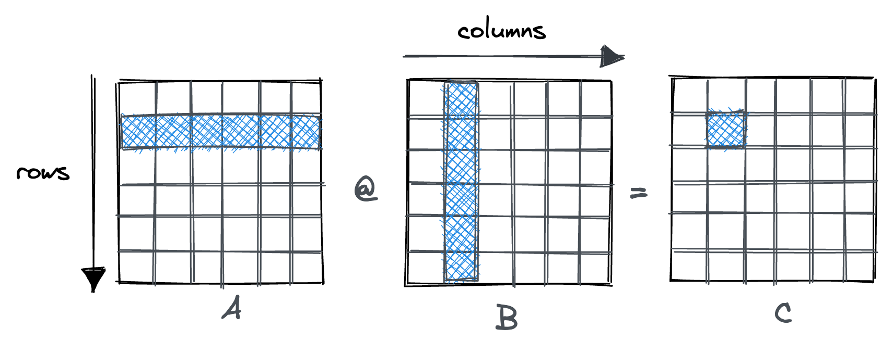

# ***matrix-multiplication***

### _2D/3D_ matrix multiplication using `python3`

In linear algebra and machine learning, matrix multiplication is a fundamental concept. 
There are many ways to add and multiply matrices mathematically and programmatically. 
Here are some implementations purely using python.




## explicit with nested loops
```python
def matrix_multiply_nested_loops(matrix_1, matrix_2):
    # Get dimensions of the input matrices
    rows_1, cols_1 = len(matrix_1), len(matrix_1[0])
    rows_2, cols_2 = len(matrix_2), len(matrix_2[0])

    # Check if the matrices can be multiplied
    if cols_1 != rows_2:
        return "Matrix dimensions do not match for multiplication"

    # Create an empty result matrix to store the multiplication result
    res = [[0 for x in range(cols_2)] for y in range(rows_1)]

    # Use nested for loops to iterate through rows and columns of the matrices
    for i in range(rows_1):
        for j in range(cols_2):
            for k in range(rows_2):
                # Calculate the element at row 'i' and column 'j' of the result matrix
                res[i][j] += matrix_1[i][k] * matrix_2[k][j]
    
    return res

# Test the function
matrix_1 = [
    [1, 2, 3],
    [4, 5, 6],
    [7, 8, 9]
]

matrix_2 = [
    [0, 1, 2],
    [3, 4, 5],
    [6, 7, 8]
]

result = matrix_multiply_nested_loops(matrix_1, matrix_2)
print("Resulting matrix:", result)
```
## `numpy`
```python
# Import numpy for matrix operations

import numpy as np

def get_user_matrix(dimensions_prompt, elements_prompt):
    """
    Get a matrix from the user based on provided prompts for dimensions and elements.
    """
    rows, cols = map(int, input(dimensions_prompt).split())
    matrix = [list(map(int, input().split())) for _ in range(rows)]
    return np.array(matrix)

def generate_random_matrix(rows, cols, min_val=0, max_val=10):
    """
    Generate a random matrix with given dimensions and element value range.
    """
    return np.random.randint(min_val, max_val+1, (rows, cols))

# Main Function

def matrix_multiply_numpy(matrix_1, matrix_2):
    """
    Multiply two matrices using numpy's dot function.
    """
    if matrix_1.shape[1] != matrix_2.shape[0]:
        return "Matrices cannot be multiplied due to incompatible dimensions."
    return np.dot(matrix_1, matrix_2)

def matrix_multiply_extended(option="manual", matrix_1=None, matrix_2=None):
    """
    Multiply two matrices either manually entered, randomly generated, or provided.
    """
    if option == "manual":
        matrix_1 = get_user_matrix("Enter dimensions for Matrix 1: ", "Enter elements for Matrix 1: ")
        matrix_2 = get_user_matrix("Enter dimensions for Matrix 2: ", "Enter elements for Matrix 2: ")
    elif option == "random":
        rows_1, cols_1 = 3, 3  # Modify as needed
        rows_2, cols_2 = 3, 3  # Modify as needed
        matrix_1 = generate_random_matrix(rows_1, cols_1)
        matrix_2 = generate_random_matrix(rows_2, cols_2)
    return matrix_multiply_numpy(matrix_1, matrix_2)

# Example usage (commented out; can be uncommented for testing)
# result = matrix_multiply_extended(option="random")
# print("Result of matrix multiplication:", result)
```
## `torch`
```python
import torch

# Define two matrices as PyTorch tensors

matrix_1 = torch.tensor([[1,2,3],
                        [4,5,6],
                        [7,8,9]])

matrix_2 = torch.tensor([[0,1,2],
                        [3,4,5],
                        [6,7,8]])

# Calculate the dot product of matrix_1 and matrix_2 using .matmul()
product = torch.matmul(matrix_1, matrix_2)

# Print resulting matrix
print(product)
```
## Roadmap & Tasks

- [ ] Include matrix operations such as `"+"`,  `transpose()`,  `linalg.inv()`
- [ ] Use `JAX` as it supports `numpy` on GPU
- [ ] Wrap code in functions 
- [ ] Allow user input 
- [ ] Random matrix generation 
- [ ] Add docstrings
- [ ] Enable unit tests
- [ ] Create visualizations with `matplot`